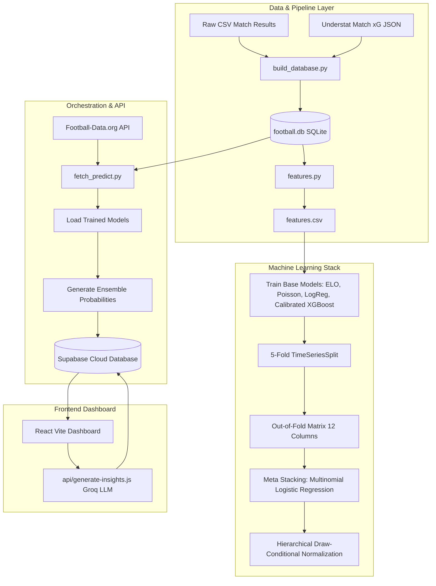

# ⚽ Spieltag - Complete System Architecture Walkthrough

Welcome back! This document provides a highly detailed walkthrough of the entire **Spieltag** codebase, from the backend data pipelines and machine learning algorithms to the database schema and the interactive React dashboard.

---

## 🗺️ High-Level System Architecture

Spieltag is structured as an end-to-end predictive engine that reads football match data, engineers chronological features, runs machine learning inference, saves results in a cloud database, and displays them on a modern, high-fidelity UI.

---

## 🗃️ 1. Data Pipeline & Storage

The system reads historical Bundesliga 1 & 2 fixtures from 2013 to 2024 to train its models and maintain continuous metrics.

### 📊 Raw Data Sources (`data/raw/`)
*   **`D1 *.csv` & `D2 *.csv`**: Football-Data.co.uk csv match logs representing fixture dates, teams, division, and full-time goals (`FTHG`, `FTAG`).
*   **`understat_bl1.json`**: Expected Goals (xG) statistics mapped to Bundesliga 1 matches parsed from Understat.

### 🛠️ Ingestion Pipeline (`pipeline/build_database.py`)
1.  Loads all historical CSVs, cleaning dates and normalizing team names.
2.  Performs fuzzy string match alignment (`difflib`) to join Understat xG metrics with the CSV-ingested fixtures on a match-by-match basis.
3.  Exports a unified SQLite database: `data/processed/football.db`.

### 🧬 Feature Engineering (`pipeline/features.py`)
To prevent data leakage, features are computed **chronologically** using state dictionaries that are updated only *after* a match outcome is processed:
*   **ELO Ratings**: Evaluates long-term quality adjustments (home-field advantage tuned for Bundesliga parity).
*   **Rolling xG & Goals**: Computes 5-game rolling expected goals scored (`home_xg_avg5`) and conceded (`away_xg_avg5`).
*   **H2H Metrics**: Encodes relative head-to-head match histories, scaling data confidence if fewer meetings are found (`h2h_data_quality`).
*   **Rest Periods**: Evaluates rest difference days (`rest_diff`) between opponents.
*   **Promotion Fallback**: When a team is newly promoted to BL1 and lacks recent top-flight xG history, it scales down their Bundesliga 2 goals by **85%** (`0.85`) to act as a robust cold-start proxy.

---

## 🧠 2. Machine Learning Architecture (`models/`)

Spieltag uses a **Two-Tier Stacking Ensemble** to minimize **Log Loss** (ensuring predicted probabilities are mathematically well-calibrated and stable).

### 🥇 Tier 1: Base Models
1.  **Poisson Model (`poisson_model.py`)**: Uses rolling xG metrics to fit independent Poisson distributions, evaluating a combinatorial goal matrix to obtain Home / Draw / Away probabilities.
2.  **ELO Classifier (`elo.py`)**: Mathematically maps ELO rating gaps to literal probability outputs.
3.  **Logistic Regression (`logistic.py`)**: A linear classifier evaluated purely on derived comparative metrics (e.g. `xg_diff`, `strength_diff`, `rest_diff`) to circumvent multicollinearity.
4.  **Calibrated XGBoost (`xgboost_model.py`)**:
    *   Tuned with **Optuna** (50-trial search over 5-fold TimeSeries split).
    *   Wrapped in `CalibratedClassifierCV` (Isotonic regression) to ensure true probability mapping.
    *   Applies a **Time-Decay Weight Function** ($W = e^{-\lambda \cdot t}$) prioritizing recent match signals over historical matches.

### 🥈 Tier 2: Meta-Stacking Ensemble (`ensemble.py`)
*   **Out-of-Fold (OOF) Vectors**: Generates a 12-column OOF matrix (3 probabilities per each of the 4 base models) using a strict chronological 5-fold `TimeSeriesSplit`.
*   **Meta Classifier**: Trains a multinomial `LogisticRegression` on the OOF matrix to balance out individual model weaknesses and errors.
*   **Hierarchical Draw Correction**: Applies conditional draw constraints to prevent noise:
    $$\text{P}_{\text{draw}} = \text{P}_{\text{draw\_raw}}$$
    $$\text{P}_{\text{home\_final}} = (1.0 - \text{P}_{\text{draw}}) \cdot \frac{\text{P}_{\text{home\_raw}}}{\text{P}_{\text{home\_raw}} + \text{P}_{\text{away\_raw}}}$$

---

## ⚡ 3. Automated Prediction Fetcher (`pipeline/fetch_and_predict.py`)

This execution pipeline connects the local model environment to your live cloud database:
1.  Fetches upcoming fixtures via the **Football-Data.org API** matching scheduled matchdays.
2.  Computes recent chronological metrics using local states inside `football.db`.
3.  Runs base model and ensemble inference.
4.  **Upserts** data directly to Supabase (`public.matches` and `public.predictions`), creating scheduled records.

---

## 🌐 4. Supabase Schema & Serverless Backend

The backend database contains two key tables that power the UI:

### 🛢️ Schema (`supabase/schema.sql`)
1.  **`public.matches`**:
    *   `match_id` (PK), `date`, `home_team`, `away_team`, `home_goals`, `away_goals`, `status` (`SCHEDULED`, `FINISHED`), and `ai_insight`.
2.  **`public.predictions`**:
    *   Linked via `match_id` to matches.
    *   Stores `model_name` ('ELO', 'Poisson', 'LogReg', 'XGBoost', 'Ensemble'), probability columns (`prob_home`, `prob_draw`, `prob_away`), and final `confidence` values.

### 🧠 Serverless API Endpoint (`dashboard/api/generate-insights.js`)
Triggers an automated **AI Match Analysis**:
*   Uses **Groq API** running `llama-3.1-8b-instant`.
*   Applies a **Row Locking Mechanism** (`GENERATING...`) to prevent duplicate API generation runs under concurrent user actions.
*   Feeds the LLM with team names and all model probabilities, prompting a concise, professional 2-3 sentence analysis.

---

## 🎨 5. Interactive Frontend React Dashboard (`dashboard/`)

A React Single Page Application (SPA) powered by **Vite** and styled using Tailwind CSS (utilizing v4 theme layer constructs).

### 📐 User Interface Layout & Styling
*   **Harmonious Color Palette**: Tailored dark backdrop values (`#0a0a0b` to `#1c1c1f`) enriched by neon accents (cyan, green, red, blue) that feel premium.
*   **Glassmorphism & Micro-animations**:
    *   Cards (`.match-card`) feature active gradient hover backgrounds (`linear-gradient(145deg, #b8fff0 0%, #5dcaa5 40%, #1d9e75 100%)`) with smooth translateY lifts.
    *   Footer action icons have dynamic opacities and subtle visual highlights.
*   **Google Typography**: Custom import of the `Inter` font family for modern, clean text rendering.

### 📱 Core Pages & UI Components
*   **`Navbar.jsx`**: Sleek header holding your main application title and branding.
*   **`Home.jsx`**:
    *   Queries `public.matches` for current scheduled fixtures and maps their corresponding `Ensemble` predictions.
    *   Renders matches in a responsive, gorgeous CSS grid.
*   **`MatchCard.jsx`**:
    *   Displays upcoming fixtures, probability shares, and the absolute prediction confidence.
    *   Draws a relative probability bar segment indicating visual predictions.
*   **`MatchDetail.jsx` (Deep Dive Page)**:
    *   Displays large matchup titles and team layouts.
    *   Includes a interactive comparative **Bar Chart** (`recharts` responsive canvas) matching the predictions of ELO, Poisson, Logistic Regression, XGBoost, and the Stacking Ensemble models.
    *   Offers a trigger to generate or load the **AI Match Context** generated directly from your backend serverless endpoint.
